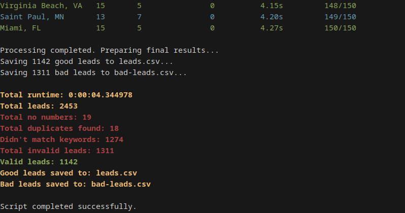

# Business Search Tool

A powerful Python tool to search for businesses across US states, leveraging the Google Places API and OpenAI for enhanced query generation.


*Figure 1: Example shell command and initial output.*


*Figure 2: Table output showcasing the retrieved business leads.*


*Figure 3: Statistics and final output after processing.*

## Features
- **Comprehensive Search:** Find businesses in major cities across all US states or specify a particular state.
- **Enhanced Queries:** Utilizes OpenAI to generate concise and targeted search queries for more accurate results.
- **Concurrency:** Efficiently processes multiple cities simultaneously using asynchronous programming.
- **Duplicate Detection:** Identifies and handles duplicate entries to ensure data quality.
- **Detailed Logging:** Offers debug mode for in-depth logging and troubleshooting.

## Installation

1. **Clone the Repository:**
   ```bash
   git clone https://github.com/yourusername/business-search-tool.git
   cd business-search-tool
   ```

2. **Create a Virtual Environment:**
   ```bash
   python3 -m venv venv
   source venv/bin/activate
   ```

3. **Install Dependencies:**
   ```bash
   pip install -r requirements.txt
   ```

4. **Set Environment Variables:**
   - Create a `.env` file in the root directory.
   - Add your API keys:
     ```
     GOOGLE_PLACES_API_KEY=your_google_places_api_key
     OPENAI_API_KEY=your_openai_api_key
     ```

## Usage

Run the `main.py` script with the desired arguments.

### Examples
- **Search in All States for "gutters" with Top 3 Cities:**
  ```bash
  python main.py --all-states gutters -n 3
  ```

- **Search in a Specific State (e.g., California) for "landscaping" with Top 50 Cities:**
  ```bash
  python main.py --state CA landscaping -n 50
  ```

- **Enable Debug Mode for Detailed Logs:**
  ```bash
  python main.py --all-states "lighting and holiday" -n 100 --debug
  ```

- **Add Additional Keywords to the Search:**
  ```bash
  python main.py --all-states "home security" -n 50 -k "alarm,camera,monitoring"
  ```

## Output

- **Good Leads:** Saved to `leads.csv`.
- **Bad Leads:** Saved to `bad-leads.csv`.


*Figure 2: Example of the table output format.*


*Figure 3: Example of the statistics and final output after processing.*


*Figure 4: Sample output of the leads.csv file.*

## Configuration

All default settings are centralized in `config/config.py`. Ensure your API keys are correctly set in the environment variables.

```python:config/config.py
import os

# API Keys
GOOGLE_PLACES_API_KEY = os.environ.get('GOOGLE_PLACES_API_KEY')
OPENAI_API_KEY = os.environ.get('OPENAI_API_KEY')

# Constants
BUSINESS_TYPE = "Lighting and Holiday"
MAX_RETRIES = 3
BACKOFF_TIME = 2
```

## AI-Enhanced Keyword and Query Generation

This tool leverages GPT-4 to enhance the search process:

1. **Keyword Prediction**: GPT-4 analyzes the initial business type or niche and suggests relevant keywords that might not be immediately obvious.

2. **Query Optimization**: The AI generates optimized search queries that are more likely to yield relevant results from the Google Places API.

3. **Niche Understanding**: GPT-4's broad knowledge helps in understanding industry-specific terminologies and trends, improving search accuracy.

This AI integration allows for more comprehensive and targeted business searches, potentially uncovering leads that traditional keyword searches might miss.

## Contributing

Contributions are welcome! Please open an issue or submit a pull request for any improvements or bug fixes.

## License

MIT License. See [LICENSE](LICENSE) for more information.
